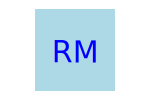

# SVG Logo Maker
  

  ## Description
  The application prompts the user to select a color and shape, provide text for the logo, and save the generated SVG to a .svg file.

  ## Table of Contents 
  * [Description](#description)
  * [Installation](#installation)
  * [Usage](#usage)
  * [Credits](#credits)
  * [License](#license)
  * [Features](#features)
  * [How to Contribute](#how-to-contribute)
  * [Tests](#tests)
  * [Questions](#questions)
  
  ## Installation
  1.) Clone the repo: git@github.com:mancillh/SVG-Logo-Maker.git
  2.) In the command line, type npm init -y
  3.) In the command line, type npm i Inquirer@8.2.4.
  4.) Answer prompts to generate your own icon!

  ## Usage
  Walkthrough Video:

  Example Icons:
  
  
  
  
  
  

  ## Credits
  N/A

  ## License
  This application is covered under MIT License
  [MIT License Link](https://opensource.org/license/MIT)

  ## Features
  N/A

  ## How to Contribute
  Fork the repo. Make changes. Push changes.

  ## Tests
  JEST was used for testing.

  If you would like to test the code with JEST, in addition to the installation steps mentioned above, install JEST.
  1.) In the command line, type npm install --save-dev jest
  2.) Add the following section to your package.json:
      {
        "scripts": {
          "test": "jest"
        }
      }
  3.) In Node terminal, npm test

  ## Questions
  My GitHub username: mancillh 

  My GitHub profile: https://github.com/mancillh 

  For additional questions, contact me at: mancillh@gmail.com