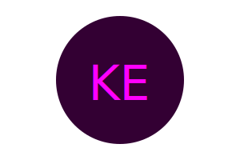
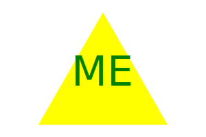

# SVG Logo Maker
  

  ## Description
  The application prompts the user to select a color and shape, provide text for the logo, and save the generated SVG to a .svg file.

  ## Table of Contents 
  * [Description](#description)
  * [Installation](#installation)
  * [Usage](#usage)
  * [Credits](#credits)
  * [License](#license)
  * [Features](#features)
  * [How to Contribute](#how-to-contribute)
  * [Tests](#tests)
  * [Questions](#questions)
  
  ## Installation
  1.) Clone the repo: git@github.com:mancillh/SVG-Logo-Maker.git
  2.) In Node terminal, type npm init -y
  3.) In Node terminal, type npm i Inquirer@8.2.4.
  4.) Answer prompts to generate your own icon!

  ## Usage
  Walkthrough Video:

  Example Icons:
  
  
  
  
  
  

  ## Credits
  N/A

  ## License
  This application is covered under MIT License
  [MIT License Link](https://opensource.org/license/MIT)

  ## Features
  N/A

  ## How to Contribute
  Fork the repo. Make changes. Push changes.

  ## Tests
  JEST was used for testing.

  If you would like to test the code with JEST, in addition to the installation steps mentioned above, install JEST.
  1.) Create a new test.js file and copy the testing code below (or create your own)
  2.) In NODE terminal, npm install --save-dev jest
  3.) Add the following section to your package.json:
      {
        "scripts": {
          "test": "jest"
        }
      }
  4.) In Node terminal, npm test

  Here is the code for the tests:
      "const { Circle, Triangle, Square } = require('./shapes.js');

      describe('Circle render', () => {
      const circle = new Circle('a', 'b', 'c')

      test('render should return a string', () => {
        expect(circle.render()).toEqual(`<svg version="1.1" width="300" height="200" xmlns="http://www.w3.org/2000/svg">

      <circle cx="150" cy="100" r="80" fill="b" />

      <text x="150" y="125" font-size="60" text-anchor="middle" fill="a">c</text>

      </svg>`)
    })
  });

    describe("Triangle render", () => {
    const triangle = new Triangle('a', 'b', 'c');

    test('render should return a string', () => {
      expect(triangle.render()).toEqual(`<svg version="1.1" width="300" height="200" xmlns="http://www.w3.org/2000/svg">

    <polygon points="150, 18 244, 182 56, 182" fill="b" />

    <text x="150" y="125" font-size="60" text-anchor="middle" fill="a">c</text>

    </svg>`)
    })
  });

    describe("Square render", () => {
    const square = new Square('a', 'b', 'c');

    test('render should return a string', () => {
      expect(square.render()).toEqual(`<svg version="1.1" width="300" height="200" xmlns="http://www.w3.org/2000/svg">

    <polygon points="230, 18 230, 182 70, 182 70, 18" fill="b" />

    <text x="150" y="125" font-size="60" text-anchor="middle" fill="a">c</text>

    </svg>`)
    })
  })"

  ## Questions
  My GitHub username: mancillh 

  My GitHub profile: https://github.com/mancillh 

  For additional questions, contact me at: mancillh@gmail.com